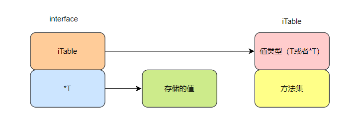

# 接口声明

- 接口支持匿名字段，可以将一个接口嵌入到另一个接口中
  
  ```go
  type Writer interface {
      Write(p []byte) (n int, err error)
  }
  type Reader interface {
      Read(p []byte) (n int, err error)
  }
  type ReadWriter interface {
      Reader
      Writer
  }
  ```

# 接口实现

- go的接口是`非侵入式`的接口，只要一个类型实现了某个接口的全部方法，就可以认为该类型实现了该接口

- 某类型实现接口是继承语义，代表该类型是(is-a)特定接口类型，可以直接将该类型赋值给特定接口类型
  
  ```go
  var w io.Writer
  w = os.Stdout //os.Stdout实现了io.Writer
  ```

# 接口赋值

- 接口的内存布局如图所示，要对接口进行赋值，首先某个类型T要实现该接口。

- 赋值给接口后，接口会将存储该变量的地址，通过该地址才可以调用类型T``的方法。

- 然后接口会保存赋值的类型，是T形式的还是*T形式的，这两种形式有不同的方法集

- `T形式的方法集是*T形式的方法集的子集`



- note：为什么T形式的方法集是*T形式的方法集的子集？这是精心设计过的，将某结构体按照T形式赋值给接口，语义上是对该变量的一次拷贝，此时该拷贝变量调用接收者为指针形式的方法没有意义，因为如果该方法改变成员变量的值的话，改变的只是拷贝，并不会影响原变量。看完下面的程序会更容易理解这段话：
  
  ```go
  type Add interface {
      add()
  }
  
  type Addptr interface {
      addptr()
  }
  
  type Addall interface {
      Add
      Addptr
  }
  
  type Point struct {
      X, Y int
  }
  
  func (p *Point) addptr() {
      p.X += 1
      p.Y += 1
  }
  func (p Point) add() {
      p.X += 1
      p.Y += 1
  }
  
  func main() {
      var a Addall
      p := Point{1, 1}
      a = &p
      fmt.Println("a init -- ", a) //a init --  &{1 1}
      a.add()
      fmt.Println("a add -- ", a) //a add --  &{1 1}
      a.addptr()
      fmt.Println("a addptr -- ", a) //a addptr --  &{2 2}
  
      // var b Addall
      // b = p //错误！p并没有实现Addall接口
  
      var b Add
      b = &p
      fmt.Println("b init from ptr -- ", b) //b init from ptr --  &{2 2}
      b = p
      fmt.Println("b init -- ", b) //b init --  {2 2}
  
      var c Addptr
      c = &p
      fmt.Println("c init from ptr -- ", c) //c init from ptr --  &{2 2}
      // c = p //错误！p没有实现Addptr接口
  ```
